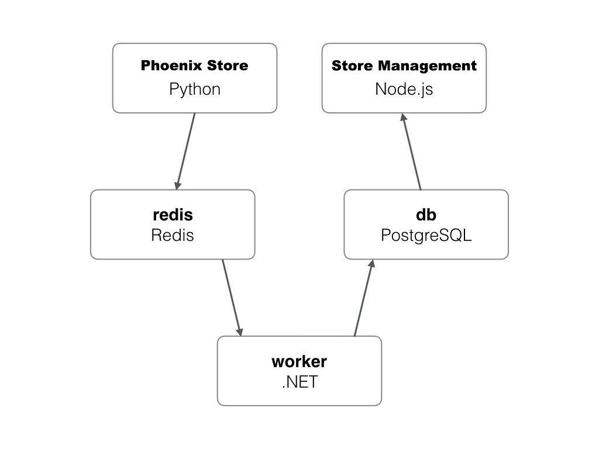

Huawei Cloud UCS demo: PHOENIX AUTO PARTS ONLINE MALL
=========

### Introduction

> Sample code suite is a set of e-commerce mall example codes. This set of sample codes is characterized by its complex structure, simple logic, small amount of code, and rich technology stack. It can help developers quickly learn various features of Huawei devCloud and deal with various problems that may arise in the software development, testing, and deployment process using microservices.

#### Architecture and Business Scenarios

The Phoenix Mall sample program consists of 5 microservice components that can be developed, tested, and deployed independently, which are:

* Client UI Service:
  * Business Logic: Users can access the WebUI of this service through a browser and click the Like button on specific products. The service saves the records of the items chosen by users in Redis cache.
  * Technology Stack: Python, Flask framework
  * Application Server: Gunicorn
* Management UI Service:
  * Business Logic: Users can access the WebUI of this service through a browser, which dynamically displays the statistical data of user clicks on the Like button on the client UI. This data comes from the PostgreSQL database.
  * Technology Stack: node.js, express framework
  * Application Server: server.js
* Worker Process Service:
  * This service is a background process that monitors the item records in the Redis cache, extracts new records, and saves them in the PostgreSQL database for the management UI to extract data for statistical display.
  * Technology Stack: .net core or Java (This service provides two technology stack implementations of the same function, and can be configured to choose one of them as a runtime process)
* Redis Cache
  * Business Logic: This service exists as a data persistence service for the client UI service.
* PostgreSQL Database
  * Business Logic: This service acts as the data source for the management UI service.

#### Architeture Diagram

